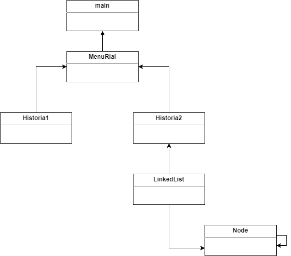
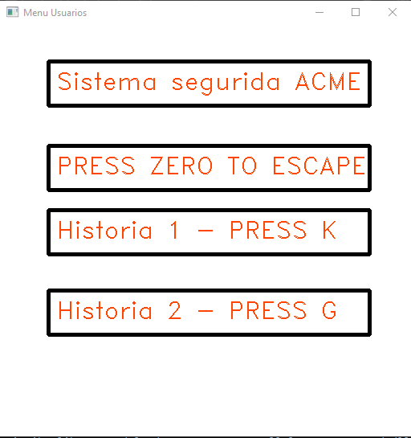
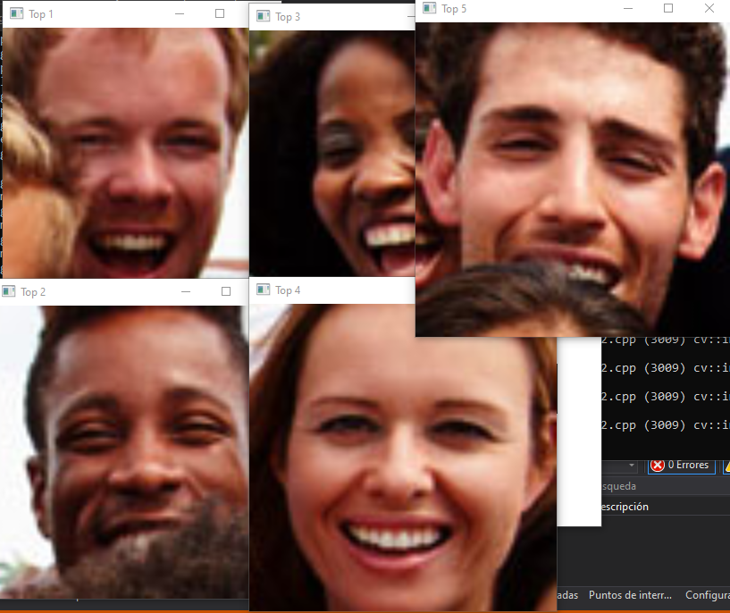

# Informe Técnico 
## Curso: Estructura de datos
### Detección y reidentificación de caras en secuencias de imágenes o video

**Alumnos:**

* Gabriel Carvajal (Bitácora)
* Pablo Rodríguez (Coordinador)

## Resumen 

> La finalidad de esta entrega es poder resolver el problema presentado haciendo uso de otras estructuras de datos.
> En este caso se utilizaron arboles, se usaron distintos arboles para resolver de mejor manera lo que requeria cada historia.
> Se agregaron 2 historias más al programa ademas de que se le hicieron a arreglos a las historias anteriores

## 1. Introducción

Para esta entrega se pedían las historias 1, 2, 3 y 5. Ademas de usar como estructura de datos los arboles, los arboles que se utilizaron quedaron a criterio nuestro y utilizamos los que mejor creimos que resolvian la historia correspondiente. En lo que respecta a las historias 1 y 2, estas ya se encontraban implementadas pero se les hicieron distintas mejoras y se adaptaron a lo que pedía esta entrega, por ejemplo: ahora la historia 1 funciona con un video en ves de una imagen y la historia 2 se implemento haciendo uso de un heaptree. Para la historia 3 se utilizó un arbol binario simple y la historia 5 no requeria uso de arboles pero si de la librería OpenCV.

### 1.1 Descripción del problema
El problema esta vez era poder encontrar una forma de diferenciar los rostros para así poder agregarlos a un arbol binario. Esto se logro gracias a la libreria OpenCV que cuenta con una funcion que calcula la diferencia euclidiana entres 2 imagenes y en base a la distancia que retorna y distintos numeros se puede llegar a ciertos numeros que funcionan como criterio para saber si la persona era la misma en las 2 fotos. Nos encontramos con algunos problemas como que cuando una persona se reia demasiado o cambiaba mucho su rostro el programa no lo reconocia como la misma persona, pero no se profundizo en la solucion de ese problema ya que nos enfocamos en el uso de arboles como estructura de datos para poder almacenar los rostros juntos a un ID.
### 1.2 Objetivos 

**Objetivo General**

Utilizar el arbol que correspondiera para poder almacenar las imagenes y responder las historias correspondientes. Ademas de encontrar un manera de guardar el video como una copia de seguridad.

**Objetivos específicos**

1. Hacer que la historia 1 funcionara con un video, en este caso uno entregado por el profesor.
2. Implementar la historia 2 haciendo uso de un heaptree ya que facilita el poder encontrar el top 5 de rostros que mas aparecieron.
3. Encontrar una forma de dividir el video en secciones para asi poder contar cuantas personas aparecieron por seccion con el fin de llevar un conteo.
4. Investigar y luego implementar una forma para poder almacenar una copia de seguridad del video en la carpeta del proyecto, para la historia 5.

### 1.3 Solución propuesta

Usar una arquitectura donde se pudiera trabajar cada historia por separado con el fin de poder repartirnos el trabajo y de que ademas las distintas historias no se afectaran entre ellas ya que seria un problema que dependieran una de la otra por que se perderia libertad a la hora de realizar la implementacion. Y también usar un arbol creado por nuestra parte y otro arbol implementado por el profesor que dicta la asignatura Juan Bekios.

## 2. Materiales y métodos

Lenguaje de programación C++, librería OpenCV.

### 2.1 Diseño 





Para darle una mejor organización al código decidimos utilizar una clase llamada MenuRial la cual sólo tiene un constructor, pero dentro del constructor hace la implementación de un menú bastante simple para poder ir navegando entre las 2 historias ahora disponibles. La navegación de las funcionalidades se realiza con el teclado donde se puede ingresar la tecla que se indique ya sea en minúscula o mayúscula para poder acceder a la historia que se desee, por otro lado se puede utilizar el 0 para darle fin al programa.



Luego de haber elegido una historia con uso del teclado, se llama a la clase de la historia que corresponda. Ambas clases son muy parecidas en el sentido de que se implementan en su constructor, se decidió esto ya que la implementación no es muy extensa en tema de líneas gracias a la librería. La diferencia que tienen estas clases es que como se puede ver en el diagrama la historia 2 se implementó haciendo uso de una clase llamada LinkedList que a su vez usa otra clase llamada Node, con el fin de implementar una LinkedList sin hacer uso de librerías y además solo con los métodos que realmente se utilizaron. Consideramos esto como ventaja ya que para mostrar el Top5 de rostros que aparecieron(Método que aún no está implementado en su totalidad debido a problemas con la comparación de rostros) se usó la siguiente función personalizada para mostrar las imágenes, esta función puede servir cuando se logre tener la LinkedList ordenada:

```c++
1. void LinkedList::show() {
2.    // Muestra el top 5 y luego las destruye para dar el efecto de q se cerro la historia
3.    Node* aux = first;
4.    string top = "Top ";
5.    for (int i = 1; i <= 5; i++) {
6.        top = top + to_string(i);
7.        cv::resize(aux->cara, aux->cara, cv::Size(), 4, 4);
8.        cv::imshow(top, aux->cara);
9.        aux = aux->next;
10.       top = "Top ";
11.   }
12.   cv::waitKey(0); // Para q las imagenes mostradas no desaparezcan
13.   for (int i = 1; i <= 5; i++) {
14.       top = top + to_string(i);
15.       cv::destroyWindow(top);
16.       top = "Top ";
17.   }
18.}
```

### 2.2 Implementación

Para poder lograr la implementación de la historia 2 se usó un código muy parecido al de la historia anterior la diferencia fue el tener que añadir las caras a la linkedlist, esta linkedlist almacena las caras en un tipo de dato llamado Mat que se tiene gracias a la librería, el problema es que la función que detecta las caras y las almacena en un vector almacena datos de tipo Rect. Este tipo de dato no nos sirve para trabajar ya que si deseamos mostrar fotos por pantalla o trabajar con imágenes se trabaja generalemente con datos de tipo Mat. Pero lo bueno de este tipo de dato (Rect) es que nos entrega las coordenadas de la cara en el frame, esto si resulta muy útil ya que podemos recortar la imagen del frame y así obtener el rostro como tipo Mat.

#### Almacenamiento en LinkedList

Este es el código que se utilizó para poder conseguir las caras en tipo de dato Mat y asi poder almacenarlas en la LinkedList:

```c++
1. LinkedList listacaras = LinkedList();
2.	for (Rect area : faces){
3.	 Rect roi(Point(cvRound(area.x * scale), cvRound(area.y * scale)),
4.		Point(cvRound((area.x + area.width - 1) * scale), cvRound((area.y + area.height - 1) * scale)))
5.		listacaras.add(foto_familia(roi));
6.	}
7.	listacaras.show();
```
- Primera línea: Crea la LinkedList a utilizar para almacenar las caras.
- Segunda línea: Inicializa un ciclo for que itera por un vector donde están almacenadas todas las caras como tipo de dato Rect.
- Tercera y Cuarta línea: Se le pasan las coordenadas del rostro a la función roi() para luego poder recortar la cara del frame principal.
- Quinta línea: Añade la cara a la linked list, se utiliza roi dentro de la función para mandar la cara recortada.
- Séptima línea: Utiliza el método explicado anteriormente para poder desplegar el top5 de caras.

## 3. Resultados obtenidos
Al inicializar el programa y elegir la "Historia 2" se despliega lo siguiente:

Podemos comprobar entonces que nuestro programa funciona, reconoce rostros y los guarda.

## 4. Conclusiones
La implementación de una LinkedList en nuestro programa nos solucionó el problema de almacenamiento de rostros, además es una clase fácilmente personalizable en la cual podemos seguir añadiendo funcionalidades como búsqueda de rostros o conteo. De todas maneras nuestro código cumple con la funcionalidad pero no con el orden, limpieza y formalidad, trabajaremos para darle una estructura y sentido definidos. 
# Anexos

## Anexo A: Instalación librerías OpenCV
Descargamos de la página oficial, https://opencv.org/releases/, la última versión (4.5.3) y descomprimimos el archivo ZIP en donde nos acomode más. Ahora debemos editar las variables de entorno de nuestro sistema, "Propiedades del sistema"->"Opciones avanzadas"->"Variables de entorno"->"PATH"->"Editar"->"Nuevo" y ponemos la dirección donde tengamos nuestra carpeta de OpenCV seguido de "\build\x64\vc15\bin", apretamos "Aceptar" y listo.
## Anexo B: Instalación de IDE y configuración librerías OpenCV
Descargamos de la página oficial el instalador de Visual Studio 2019 (no confundir con Visual Studio Code), https://visualstudio.microsoft.com/es/downloads/, y lo ejecutamos, seguir la instalación normal de cualquier programa, al iniciarlo por primera vez nos preguntará para qué tipo de trabajo lo usaremos, escogemos "Desarrollo para el escritorio en C++".
Una vez instalado crearemos un nuevo proyecto e iremos a la barra de herramientas en la parte superior de la pantalla, ahí daremos click a "Project"->"Proyecto Properties" y nos abrirá una ventana, ahí haremos lo siguiente: en "VC++ Directories"->"Include directories"->"Edit"->"New Line" e indicamos el directorio de nuestro OpenCV seguido de "\build\include" y apretamos OK; ahora en "Library directories" hacemos lo mismo pero al indicar el directorio, agregamos lo siguiente "\build\x64\vc15" y apretamos OK; ahora vamos a "Linker" y editamos "Additional dependencies" y escribimos lo siguiente: opencv_world453d.lib, el numero después de "world" variará según la versión instalada.

# Referencia

Indicar los libros, páginas web, documentos, etc. Utilizados en el trabajo. Por ejemplo:

1. MONTERO, J.,Metodos matemáticos aplicados a la ganadería.3aed. Sevilla: Ediciones de la pradera,2007.
2. LVARADO,   J.   P.,¿Qué   debe   contener   un   artículo   científico?.http://www.ie.tec.ac.cr/palvarado/pmwiki/index.php/MSc/Art\%c3\%adculoCient\%c3\%adfico. Fe-cha de acceso:13/Nov/2018
